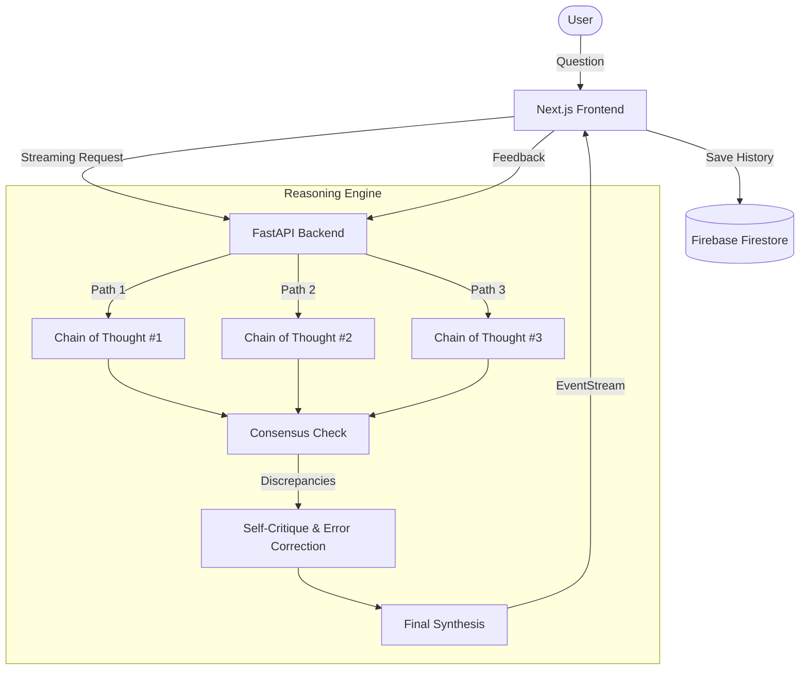

# 🧠 Self-Correcting Reasoning Engine

[](https://nextjs.org/)
[](https://fastapi.tiangolo.com/)
[](https://tailwindcss.com/)
[](https://www.netlify.com/)
[](https://render.com/)

An advanced LLM reasoning framework implementing **"Learning Self-Correcting Reasoning Policies Without Supervision"**. This project demonstrates a production-grade interface for visualizing real-time "thinking" processes, consensus scoring, and automated error correction.

---

## ✨ Key Features

- 🏎️ **Real-Time Streaming**: Live EventStream connection from FastAPI backend to Next.js frontend for instant reasoning trace updates.
- 🌳 **Multi-Path Reasoning**: Generates 3 independent "Chains of Thought" for every prompt.
- ⚖️ **Consensus Verification**: Automatically compares reasoning paths to identify logic drifts or hallucinations.
- 🛠️ **Iterative Self-Correction**: Implements a self-critique loop where the AI identifies and fixes its own reasoning errors before final synthesis.
- 📊 **Confidence Scoring**: Dynamic cross-path agreement calculations to provide a final reliability metric.
- 🎨 **Premium UI/UX**: Built with Framer Motion, glassmorphism aesthetics, and a "Neural Progress" visualization system.
- 🔒 **Authentication**: Full Firebase Auth with email/password, Google, and GitHub OAuth.
- 📈 **Performance Analytics**: Dashboard with real-time metrics on reasoning quality, latency, and accuracy.

---

## 🏗️ Architecture



---

## 🚀 Quick Start

### Prerequisites

- **Node.js** >= 18
- **Python** >= 3.10
- **npm** or **yarn**

### Frontend Setup

```bash
cd scroll-animation
npm install
cp .env.example .env.local
# Fill in your Firebase credentials in .env.local
npm run dev
```

### Backend Setup

```bash
cd backend/python
python -m venv venv
source venv/bin/activate  # On Windows: venv\Scripts\activate
pip install -r requirements.txt
cp .env.example .env
# Add your OPENROUTER_API_KEY to .env
python main.py
```

---

## 🚀 Deployment Instructions

### Frontend (Netlify)
1. **Repository**: Link the `scroll-animation` folder.
2. **Environment Variables** (set in Netlify dashboard, NOT in code):
   - `NEXT_PUBLIC_PYTHON_BACKEND_URL`: Your Render service URL.
   - `NEXT_PUBLIC_FIREBASE_API_KEY`, etc. (Standard Firebase credentials).

### Backend (Render)
1. **Build Command**: `pip install -r requirements.txt`
2. **Start Command**: `python main.py`
3. **Environment Variables**:
   - `OPENROUTER_API_KEY`: Required for LLM access.

---

## 🛠️ Technology Stack

| Layer | Technology |
|---|---|
| **Frontend** | React 19, Next.js 16, Framer Motion, Tailwind CSS 4 |
| **Backend** | Python 3.10+, FastAPI, SSE (Server-Sent Events) |
| **Intelligence** | OpenRouter (LLaMA-3.3-70B-Instruct) |
| **Database** | Firebase Firestore |
| **Authentication** | Firebase Auth (Email, Google, GitHub) |
| **Hosting** | Netlify (Static/Edge), Render (Web Service) |
| **Testing** | Pytest (Backend), Jest + React Testing Library (Frontend) |
| **CI/CD** | GitHub Actions |

---

## 📖 Research Reference
This project is an implementation experiment based on the paper:  
> **"Learning Self-Correcting Reasoning Policies in Large Language Models Without Supervision"**  
> *Exploring self-improvement loops where models learn to correct their own mistakes through consensus.*

---

## 🧪 Testing

### Backend Tests
```bash
cd backend/python
pip install pytest pytest-asyncio httpx
pytest tests/ -v
```

### Frontend Tests
```bash
cd scroll-animation
npm test
```

---

## 📁 Project Structure

```
Mini-Project-4th-sem/
├── scroll-animation/          # Next.js frontend
│   ├── src/
│   │   ├── app/               # Next.js pages & routes
│   │   ├── components/        # Reusable React components
│   │   ├── context/           # Auth context providers
│   │   └── lib/               # Firebase, chat store utilities
│   └── __tests__/             # Jest frontend tests
├── backend/
│   └── python/                # FastAPI backend
│       ├── engine.py          # Self-correcting reasoning engine
│       ├── main.py            # API server with endpoints
│       └── tests/             # Pytest backend tests
├── docs/                      # Documentation
│   ├── API.md                 # API endpoint reference
│   ├── SETUP.md               # Detailed setup guide
│   └── PROJECT_FLOW.md        # Architecture & data flow
├── .github/
│   └── workflows/             # CI/CD pipeline
└── docker-compose.yml         # Docker deployment
```

---

## 🔮 Future Improvements

- Improve reasoning accuracy with better models
- Expand analytics and visualization features
- Add export functionalities (PDF/Markdown) for reasoning chains
- Implement LLM observability (LangSmith / Helicone)
- Add comprehensive E2E testing with Playwright

---

## 👨‍💻 Contributors

- **Devang Verma** — Architecture & Backend
- **Devansh Kanodia** — Frontend & Auth
- **Vinamra Bhatnagar** — Core Engine & UI

---

## 🎯 Project Purpose

This project was developed as part of academic coursework (Mini-Project, 4th Semester) to explore advanced reasoning systems using modern web technologies and AI models.

---

## 📄 License

This project is for academic purposes. All rights reserved by the contributors.
# Mini-Project-Final-4thsem
