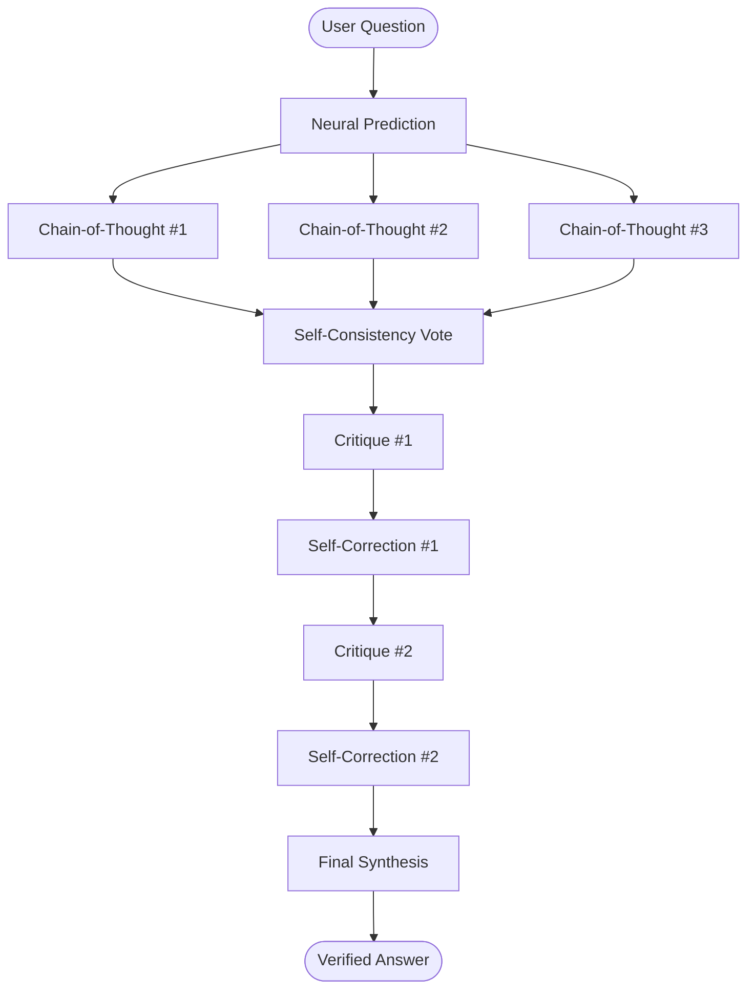

# 🧠 Self-Correcting Reasoning Engine — Backend

This folder contains the complete backend infrastructure for the Self-Correcting Reasoning Engine project.

## Architecture Overview

The backend consists of two services:

| Service | Technology | Purpose |
|---|---|---|
| **Reasoning Engine** | Python 3.10+ / FastAPI | LLM-powered multi-path reasoning, self-correction, and SSE streaming |
| **API Gateway** | Node.js / Express | REST API gateway, health checks, and route management |

---

## 📂 Project Structure

```
backend/
├── python/                 # FastAPI Reasoning Engine
│   ├── main.py             # FastAPI app, SSE streaming endpoint
│   ├── engine.py           # Self-correcting reasoning pipeline
│   ├── requirements.txt    # Python dependencies
│   ├── render.yaml         # Render deployment config
│   └── .env.example        # Environment variable template
├── node/                   # Express API Gateway
│   ├── src/
│   │   └── index.js        # Express server entry point
│   ├── package.json        # Node.js dependencies
│   └── .env.example        # Environment variable template
├── .gitignore              # Ignore patterns for both services
└── README.md               # This file
```

---

## 🚀 Quick Start

### Python Reasoning Engine

```bash
cd backend/python
python -m venv venv
venv\Scripts\activate          # Windows
# source venv/bin/activate    # macOS/Linux
pip install -r requirements.txt
cp .env.example .env
# Add your OPENROUTER_API_KEY to .env
python main.py
```

The FastAPI server starts at **http://localhost:8000**

### Node.js API Gateway

```bash
cd backend/node
npm install
cp .env.example .env
npm run dev
```

The Express server starts at **http://localhost:5000**

---

## 📡 API Endpoints

### FastAPI (Reasoning Engine)

| Method | Endpoint | Description |
|---|---|---|
| `GET` | `/health` | Health check — returns engine readiness |
| `POST` | `/solve` | Submit a question for reasoning (SSE stream response) |

### Express (API Gateway)

| Method | Endpoint | Description |
|---|---|---|
| `GET` | `/api/health` | Health check |

---

## 🔧 Environment Variables

### Python Service
| Variable | Required | Description |
|---|---|---|
| `OPENROUTER_API_KEY` | ✅ | API key for OpenRouter LLM access |
| `PORT` | ❌ | Server port (default: 8000) |

### Node.js Service
| Variable | Required | Description |
|---|---|---|
| `PORT` | ❌ | Server port (default: 5000) |

---

## 🌐 Deployment

### Render (Python Backend)
1. **Build Command**: `pip install -r requirements.txt`
2. **Start Command**: `uvicorn main:app --host 0.0.0.0 --port $PORT`
3. **Root Directory**: `backend/python`

See `python/render.yaml` for the full Render service configuration.

---

## 🔬 How the Reasoning Engine Works



1. **Neural Prediction** — Quick numeric estimate from a lightweight heuristic
2. **Multi-Path Reasoning** — 3 independent Chain-of-Thought samples via LLM
3. **Self-Consistency** — Majority-vote to select the best reasoning path
4. **Iterative Critique** — LLM critiques its own reasoning for errors
5. **Self-Correction** — Reasoning is revised based on identified issues
6. **Final Synthesis** — Verified answer is streamed back to the frontend

---

*Made for Mini-Project — 4th Semester*
